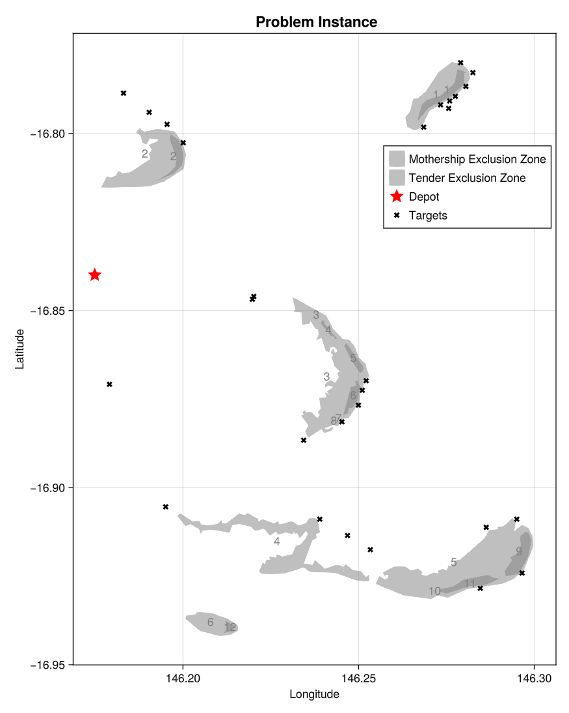
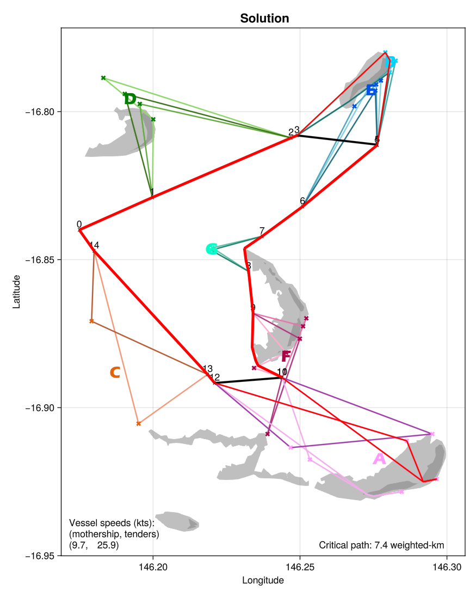
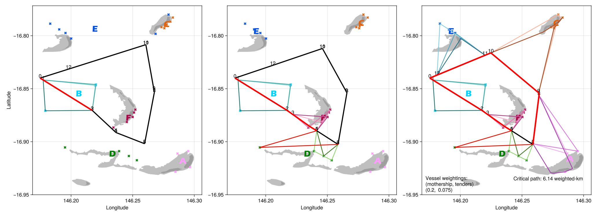

# HierarchicalRouting

HierarchicalRouting is a Julia package that implements metaheuristics to generate
near‐optimal routing solutions for a fleet of coordinated vessels, including one mothership
and a given number of satellite vessels (tenders).
The package supports planning for scenarios with multiple multiple clusters of target sites
and environmental constraints (exclusion zones).

## Setup

### Installation

To install the package, use the Julia package manager in the REPL:

```julia
] add HierarchicalRouting
```

You may check the installed version with:

```julia
] st HierarchicalRouting
```

## Quickstart

Below is an example of how to load a problem, generate an initial solution, and improve the
solution.

### Load the problem

```julia
using HierarchicalRouting

target_path = "<PATH/TO/TARGET_SCENARIO.GEOJSON>"
subset_path = "<PATH/TO/TARGET_SUBSET.GPKG>"
env_data_path = "<PATH/TO/BATHYMETRY.TIF>"
env_disturbance_path = "<PATH/TO/WAVE_DISTURBANCE.GEOJSON>"

# Load the problem configuration
problem = load_problem(
    target_path,
    subset_path,
    env_data_path,
    env_disturbance_path,
    (146.175, -16.84),              # depot (lon, lat)
    -2.5,                           # draft_ms [m]
    -1.0,                           # draft_t [m]
    0.2,                            # weight_ms [(m/s)^-1]
    0.075,                          # weight_t [(m/s)^-1]
    3,                              # n_tenders
    2;                              # t_cap
);
```

#### Problem parameters

All problem parameters (data paths, vessel capacities, clustering tolerance, etc.) must be
provided by the user directly as arguments to `load_problem()`.

The following arguments are required:
- **target_path**: The file path to a GeoJSON file containing target sites to be visited.
- **subset_path**: The file path to a geopackage file containing polygons to define the
    subset of target scenarios to be considered in the problem instance.
- **env_data_path**: The file path to a TIF file containing the data (e.g., bathymetry)
    which informs the exclusion zones, limiting access, for the mothership and tenders.
- **env_disturbance_path**: The file path to a GeoJSON file containing the environmental
    disturbance data used to generate weather disturbance events.
- **depot**: A tuple representing the depot location, in the form (lon, lat) which is the
    used as the coincident start and finish point for the deployment plan.
- **Draft**: The draft of vessels (in metres), given as a negative value, indicating the
    clearance depth of the vessel below the surface.
    - **draft_ms**: The draft of the mothership.
    - **draft_t**: The draft of the tenders.
- **Weighting**: The weighting factor for the mothership and tenders, as a multiplier of
    distance travelled to quantify time. This is defined as the inverse of the
    vessel speed in metres per second.
    - **weight_ms**: The weighting factor for the mothership.
    - **weight_t**: The weighting factor for the tenders.
- **n_tenders**: The number of tenders available to use for deployment.
- **t_cap**: The capacity of the tenders, determining the maximum number of targets
    that can be visited/deployed by a tender in a single trip.

Optional parameters are:
- **target_subset_path**: The path to save the target subset raster. Default is "".
- **output_dir**: The path to the directory to save the output files. Default is "outputs/".
- **debug_mode**: A boolean indicating whether to run in debug mode. This will read and
    write intermediate files to the output directory for inspection. Default is false.

### Generate a solution

#### Undisturbed solution
```julia
waypoint_optim_method=HierarchicalRouting.Optim.ParticleSwarm(n_particles=5)

solution = solve(
    problem,
    waypoint_optim_method
);
```

#### Disturbed solution
```julia
waypoint_optim_method=HierarchicalRouting.Optim.ParticleSwarm(n_particles=5)
disturbance_clusters=Set([2, 4])

solution_disturbed = solve(
    problem;
    waypoint_optim_method,
    disturbance_clusters,
);
```

#### Solution parameters

Additional solution parameters are defined in the `solve()` function.

The following arguments are required for `solve()`:
- **problem**: The problem instance to be solved. This is generated by the
    `load_problem()` function.

Optional parameters are:
- **k**: The (minimum) number of clusters to be used in KMeans clustering. Default is 1.
    If more clusters are required in order to satisfy problem capacity constraints, this
    will be increased to the minimum number of clusters to generate a feasible solution.
- **disturbance_clusters**: The set of clusters, denoted by the start of the cluster,
    indexed by sequence, where disturbance/s are simulated. Default is an empty set.
- **seed**: The random seed to be used for reproducibility.
- **rng**: The random number generator to be used.
- **waypoint_optim_method**: (Optim.jl) Function to use in waypoint optimization.
- **do_improve**: A boolean indicating whether to improve the initial solution by optimizing
    tender sorties. Default is true.
- **time_limit**: The time limit (in seconds) for the overall solution process.
    Default is 200 seconds.

## Visualization

To visualize the routing solution, use the `Plot` module.
Below are examples to create:
- a plot of the problem instance, with:
    - the depot,
    - exclusion zones for:
        - the mothership,
        - the tenders, and
    - target deployment locations;
- a plot of the solution, including existing problem instance elements, as well as:
    - clustered deployment locations - coloured by cluster,
    - mothership route - bold,
    - tender sorties - coloured by cluster,
    - critical path - highlighted in red;
- an iteratively disturbed solution, with a series of plots at each disturbance event,
    assuming 2 disturbance events.

### Problem instance

```julia
Plot.problem(
    problem;
    labels=true
)
```


### Solution plot

```julia
Plot.solution(
    problem,
    solution;
    highlight_critical_path_flag=true
)
```


### Disturbance solution plot

```julia
Plot.solution_disturbances(
    problem,
    solution_disturbed,
    disturbance_clusters;
    highlight_critical_path_flag=true
)
```


## Development setup

The steps below assume you are in the project root.

### Create a sandbox

Create a sandbox environment and install development dependencies.

```bash
mkdir sandbox
cd sandbox

julia project=.
(sandbox) julia> ]add Revise Infiltrate
(sandbox) julia> ]dev ..
```

### Run a development script

- Copy the quickstart to a file (e.g., `dev_routing.jl`) and save to the sandbox directory.
- Start the Julia REPL at project root:
(Assuming VS Code is configured to default to the sandbox environment)

```julia
;cd sandbox
include("dev_routing.jl")
```

## Project structure

The project structure is as follows:

```
HierarchicalRouting/
├───data
├───outputs             # Output files from analyses
├───src                 # Source code for package
│   ├───clustering      # Clustering utilities
│   ├───optimization    # Optimization heuristics
│   ├───plot            # Visualizations
│   ├───problem         # Problem setup and initialization
│   ├───processing      # Data processing functions
│   └───routing         # Routing algorithms
└───test
    └───data
```

## Solution structure

The solution (including problem) structure is as follows:

```
Problem
│
├── depot (Point{2, Float64})
├── targets (Targets)
├── mothership (Vessel)
└── tenders (Vessel)

Targets
│
├── points (DataFrame)
├── path (String)
└── disturbance_gdf (DataFrame)

Vessel
│
├── exclusion (DataFrame)
├── capacity (Int16)
├── number (Int8)
└── weighting (Float16)

MSTSolution
│
├── cluster_sets (Vector{Vector{Cluster}})
├── mothership_routes (Vector{MothershipSolution})
└── tenders (Vector{Vector{TenderSolution}})

Cluster
│
├── id (Int64)
├── centroid (Point{2, Float64})
└── nodes (Vector{Point{2, Float64}})
 
MothershipSolution
│
├── cluster_sequence (DataFrame)
└── route (Route)

Route
│
├── nodes (Vector{Point{2, Float64}})
├── dist_matrix (Vector{Float64})
└── line_strings (Vector{LineString{2, Float64}})
 
TenderSolution
│
├── id (Int64)
├── start (Point{2, Float64})
├── finish (Point{2, Float64})
└── sorties (Vector{Route})
```
